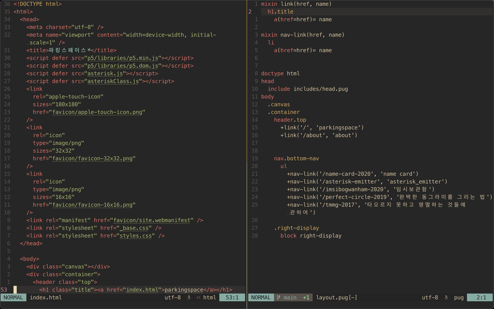

# parkingspace.me with pugjs

I rewrote my first website, _parkingspace.me_, but with pugjs this time to reduce the amount of repeating code blocks.

The left side is the first few lines of initial version of the website and the one on the right side is the base layout written in pugjs.

Visit Pug's website to learn more about the details of the project.
[pug]('https://pugjs.org/')
